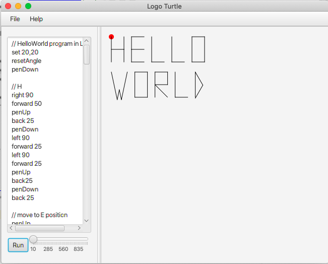

# Antlr4 Turtle

This is a very basic implementation of the [Logo Language](https://en.wikipedia.org/wiki/Logo_(programming_language) using the [Antlr4](https://www.antlr.org/) parser generator.
The Logo programs are parsed based on the [Logo Grammar](./src/main/antlr4/com/nikoskatsanos/antlrturtle/Logo.g4) and visualized in a [JavaFX](https://openjfx.io/) UI

## Grammar
The grammar and this program's capabilities __are not a full Logo Language implementation__. The basic expressions that are supported are:
- `forward ${points}`: Move forward x points
- `back ${points}`: Move backward x points
- `right ${degrees}`: Turn right x degrees
- `left ${degrees}`: Turn left x degrees
- `set ${x},${y}`: Sets the turtle on point (x,y)
- `clearscreen`: Clear the canvas
- `penUp`: The pen is up hence cannot draw to the canvas
- `penDown`: The pen is down ready to draw to the canvas
- `resetAngle`: Resets the turtle's direction angle to 0 degrees which is effectively facing east

## Example

An example of a simple `Hello World` logo program can be found at [HelloWorld.logo](src/main/resources/HelloWorld.logo)

## Running The UI

The UI can be launched by invoking [TurtleRunner](src/main/java/com/nikoskatsanos/turtle/TurtleRunner.java) and it will automatically load the example file.
Running the demo program will produce an animation like the below:

## UI Features
- User can type a logo program in the text area
- User can load a logo program from `File->Open...`
- The slider determines the drawing animation speed